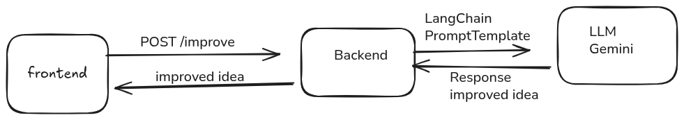

# Stunning Task - AI-Powered Idea Improver

> Transform your rough website ideas into detailed, structured prompts using Google's Gemini AI.



## 🌟 Overview

Stunning Task is a full-stack web application that helps users transform simple website ideas into comprehensive, detailed prompts. The application uses Google's Gemini AI (via LangChain) to analyze user input and generate structured website specifications including purpose, key sections, target users, and design tone.

### Key Features

- ✨ **AI-Powered Enhancement**: Leverages Google Gemini 2.5 Flash for intelligent content improvement
- 🌍 **Bilingual Support**: Automatic RTL/LTR text direction for Arabic and English
- 🎨 **Modern UI**: Beautiful, animated interface with gradient borders and premium styling
- 📝 **Markdown Rendering**: Properly formatted output with bold, headers, and lists
- 🐳 **Dockerized**: Complete Docker setup for easy deployment
- ⚡ **Real-time Processing**: Fast API responses with streaming support

## 🏗️ Architecture

The application consists of three main components:

```
┌─────────────┐      HTTP/JSON      ┌──────────────┐      LangChain      ┌─────────────┐
│   Frontend  │ ──────────────────► │   Backend    │ ──────────────────► │   Gemini    │
│   Next.js   │                     │   FastAPI    │                     │     AI      │
│  Port 3000  │ ◄────────────────── │  Port 8000   │ ◄────────────────── │   API       │
└─────────────┘      Response       └──────────────┘      AI Response    └─────────────┘
```

See [flow.png](./flow.png) for detailed architecture diagram.

## 🚀 Quick Start

### Prerequisites

- Docker & Docker Compose
- Google API Key (Gemini)

### Deployment with Docker

1. **Clone the repository**

   ```bash
   git clone <repository-url>
   cd stunning-task
   ```

2. **Set up environment variables**

   ```bash
   # Create backend .env file
   echo "GOOGLE_API_KEY=your_api_key_here" > backend/.env
   ```

3. **Start the application**

   ```bash
   docker-compose up --build
   ```

4. **Access the application**
   - Frontend: http://localhost:3000
   - Backend API: http://localhost:8000
   - API Docs: http://localhost:8000/docs

## 📁 Project Structure

```
stunning-task/
├── backend/                 # FastAPI backend
│   ├── main.py             # Main application file
│   ├── requirements.txt    # Python dependencies
│   ├── Dockerfile          # Backend Docker config
│   └── .env               # Environment variables
├── frontend/               # Next.js frontend
│   ├── app/               # Next.js app directory
│   ├── components/        # React components
│   ├── api/              # API service layer
│   ├── Dockerfile        # Frontend Docker config
│   └── package.json      # Node dependencies
├── docker-compose.yml     # Docker orchestration
├── flow.png              # Architecture diagram
└── README.md            # This file
```

## 🛠️ Technology Stack

### Frontend

- **Framework**: Next.js 16 (React 19)
- **Language**: TypeScript
- **Styling**: Tailwind CSS v4
- **UI Components**: Radix UI, Lucide Icons
- **Animations**: Tailwind Animate

### Backend

- **Framework**: FastAPI
- **Language**: Python 3.10
- **AI Integration**: LangChain + Google Generative AI
- **Model**: Gemini 2.5 Flash
- **Server**: Uvicorn (ASGI)

### DevOps

- **Containerization**: Docker
- **Orchestration**: Docker Compose

## 🎯 Features

### Frontend Features

- Real-time text direction detection (RTL/LTR)
- Animated gradient border effects
- Markdown rendering for AI responses
- Responsive design
- Error handling with user-friendly messages
- Character counter (500 max)
- Loading states and animations

### Backend Features

- RESTful API with FastAPI
- CORS support for frontend integration
- LangChain integration for AI processing
- Structured prompt engineering
- Health check endpoint
- Error handling and validation

## 📖 API Documentation

### Endpoints

#### `POST /improve`

Improve a website idea using AI.

**Request:**

```json
{
  "idea": "I want a website for my gym"
}
```

**Response:**

```json
{
  "improved_content": "**Website Purpose:**\nThe primary goal is to attract new members...\n\n**Key Sections:**\n- Home\n- About Us\n- Classes\n..."
}
```

#### `GET /health`

Health check endpoint.

**Response:**

```json
{
  "status": "ok"
}
```

## 🔧 Configuration

### Environment Variables

#### Backend (.env)

```bash
GOOGLE_API_KEY=your_gemini_api_key_here
```

#### Frontend (docker-compose.yml)

```bash
NEXT_PUBLIC_API_URL=http://localhost:8000
```

## 🐳 Docker Commands

```bash
# Start services
docker-compose up

# Start in background
docker-compose up -d

# Rebuild and start
docker-compose up --build

# View logs
docker-compose logs -f

# Stop services
docker-compose down

# Clean up everything
docker-compose down -v --rmi all
```

## 📚 Documentation

- [Frontend README](./frontend/README.md) - Frontend-specific documentation
- [Backend README](./backend/README.md) - Backend API documentation
- [Architecture Diagram](./flow.png) - Visual system architecture

## 🤝 Contributing

1. Fork the repository
2. Create a feature branch (`git checkout -b feature/amazing-feature`)
3. Commit your changes (`git commit -m 'Add amazing feature'`)
4. Push to the branch (`git push origin feature/amazing-feature`)
5. Open a Pull Request

## 📝 License

This project is licensed under the MIT License.

## 🙏 Acknowledgments

- Google Gemini AI for powerful language processing
- LangChain for AI integration framework
- Next.js and FastAPI teams for excellent frameworks
- Radix UI for accessible components
